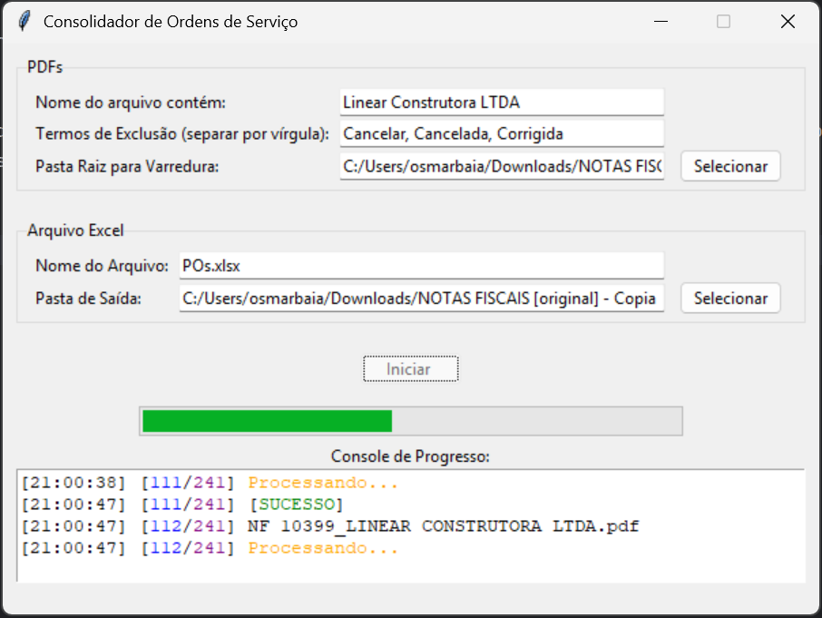
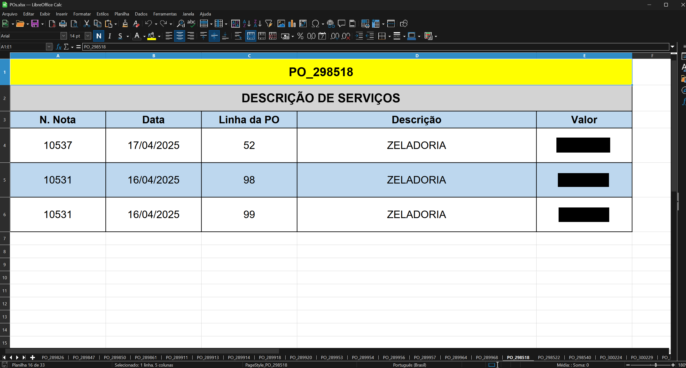

# ConsolidadorOS

Programa desenvolvido para automatizar a revisão de notas fiscais em busca de linhas de ordem de serviços espalhadas ao longo de várias notas fiscais.

## Funcionamento

1) Coleta todos os arquivos .pdf em um diretório especificado e filtra-os com base em nomenclatura 
2) Tenta fazer extração do conteúdo por leitura simples e OCR
3) Valida se o texto extraído fornece os dados desejados
    + Numero de Nota Fiscal
    + Data de Emissão
    + Linhas da Nota fiscal
4) Valida o conteúdo das linhas
    + Numero de PO 
    + Numero de Linha
    + Valor
    + Descrição
5) Trata o resultado das validações e categoriza as notas em "Precisa de Revisar" ou "Nota Processada"
6) Exporta os dados validos para um arquivo .xlsx onde cada planilha corresponde a uma OS.

## Preview
### Programa

### Planilhas
